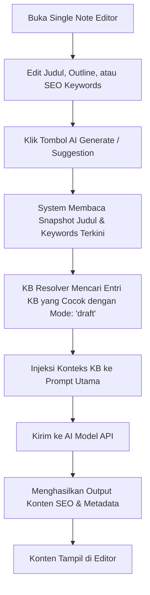
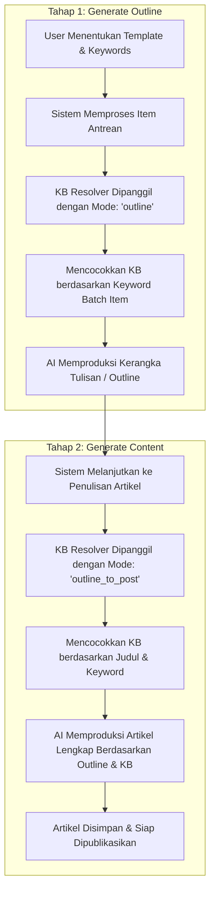

# Dokumentasi Knowledge Base (KB) & AI Workflow di Kotacom CMS

Dokumentasi ini menjelaskan secara mendalam bagaimana sistem **Knowledge Base (KB)** bekerja di Kotacom CMS, algoritma pencarian kecocokan (*matching*), serta bagaimana KB diintegrasikan ke dalam seluruh workflow AI (baik **Single Note Editor** maupun **AI Batch Generation**).

---

## 1. Konsep Dasar Knowledge Base (KB)

Knowledge Base (KB) adalah pustaka informasi yang Anda buat untuk melatih dan memberi instruksi kontekstual kepada AI. Dibandingkan melatih model AI baru, KB bertindak sebagai **Dynamic Prompt Injector**—menyisipkan data penting seperti detail produk, FAQ, daftar URL referensi, atau aturan penulisan langsung ke dalam prompt AI sebelum teks digenerate.

Setiap entri KB memiliki beberapa properti utama:
*   **Type**: Jenis informasi. Nilai yang didukung:
    *   `product`: Detail spesifikasi, fitur, dan harga produk/jasa.
    *   `url`: URL referensi eksternal (otomatis diformat sebagai tautan rujukan untuk AI).
    *   `image`: Tautan gambar aset.
    *   `block`: Blok teks kustom, seperti template promosi atau instruksi penulisan khusus.
    *   `faq`: Pertanyaan dan jawaban umum untuk diinjeksi di bagian FAQ artikel.
    *   `policy`: Aturan atau kebijakan layanan.
*   **Category**: Pengelompokan (contoh: `website`, `software`, `it-support`, `printing`).
*   **Keywords**: Kata kunci pencarian (dipisah koma). AI resolver mencocokkan kata kunci ini dengan topik artikel yang sedang digenerate.
*   **Modes**: Mode AI tempat entri ini diizinkan aktif (contoh: `outline`, `outline_to_post`, `draft`). Jika dikosongkan, entri aktif di seluruh mode.
*   **Priority**: Skala prioritas (angka lebih tinggi akan diinjeksi terlebih dahulu jika kapasitas prompt terbatas).
*   **Active**: Sakelar untuk mengaktifkan/menonaktifkan entri tanpa menghapusnya.
*   **Metadata JSON**: Format JSON opsional (misal: `{"url": "https://..."}`) untuk menyisipkan data terstruktur.

---

## 2. Cara Kerja KB Resolver (Algoritma Pencocokan)

Ketika sebuah artikel dibuat atau diedit, sistem tidak menyisipkan semua data KB sekaligus (karena keterbatasan batas karakter/token prompt). Sistem menggunakan **KB Resolver** yang bekerja sebagai berikut:

1.  **Ekstraksi Search Terms**:
    Sistem mengambil `keywords` dan `title` dari artikel yang sedang diproses. Semua kata kunci tersebut dipecah berdasarkan koma/spasi, diubah menjadi huruf kecil, dibersihkan dari karakter non-alfanumerik, dan difilter agar hanya kata dengan panjang minimal **3 karakter** yang tersimpan sebagai *Search Terms*.
2.  **Kueri Database**:
    Sistem memanggil database D1 untuk mencari entri KB yang aktif (`is_active = 1`) di bawah workspace tersebut dengan kriteria:
    *   Kolom `modes` kosong `''` ATAU mengandung nama mode AI yang sedang berjalan (contoh: `%draft%`).
    *   Mengandung pencocokan kata kunci: `keywords LIKE %term%` ATAU `title LIKE %term%` ATAU `category = term`.
3.  **Pengurutan & Batasan (Budgeting)**:
    *   Data yang cocok diurutkan berdasarkan `priority DESC` lalu `updated_at DESC`.
    *   Sistem membatasi total entri KB yang dimasukkan ke prompt (default maksimum **10 entri** atau total panjang teks **3.000 karakter**).
    *   Teks setiap entri diformat menjadi:
        ```markdown
        [Type:Category] Title
        URL: https://... (jika ada di metadata)
        Content/Isi Informasi
        ```

---

## 3. Workflow AI: Integrasi KB

Sistem mengintegrasikan KB dalam dua workflow utama pembuatan konten:

### A. Single Note Editor (Editor Artikel Tunggal)
Workflow ini digunakan ketika Anda membuat atau mengedit artikel secara manual di editor web.



*   **Mode KB yang Digunakan**: `"draft"`
*   **Trigger**: Tombol regenerasi outline, penulisan draf isi artikel, atau penulisan meta deskripsi SEO di panel editor.
*   **Cara Memaksimalkannya**: Pastikan field *SEO Keywords* di bagian pengaturan SEO artikel Anda diisi dengan istilah-istilah yang cocok dengan kolom *Keywords* di entri KB Anda.

---

## 4. AI Batch Generation (Pembuatan Konten Massal)
Workflow ini digunakan untuk memproduksi puluhan hingga ratusan artikel sekaligus dari daftar kata kunci melalui menu AI Batch.

Proses Batch terbagi menjadi dua tahap eksekusi sekuensial yang masing-masing memanfaatkan KB secara spesifik:



### Detil Tahap Batch:

1.  **Tahap 1: Generate Outline**
    *   **Mode KB**: `"outline"`
    *   **Pencarian**: Menggunakan kata kunci input antrean batch (`item.keyword`) untuk mencari entri KB.
    *   **Hasil**: AI membuat struktur judul bab (H2/H3) yang sesuai dengan kerangka KB.
2.  **Tahap 2: Generate Content**
    *   **Mode KB**: `"outline_to_post"`
    *   **Pencarian**: Menggunakan kombinasi judul outline hasil tahap 1 dan kata kunci asli.
    *   **Hasil**: AI menulis paragraf detail dengan menyisipkan fakta-fakta produk/FAQ/URL yang diambil dari KB.

---

## 5. Tips & Best Practices Penggunaan KB

Untuk mendapatkan hasil tulisan AI terbaik dan meminimalkan halusinasi informasi:

*   **Gunakan Keywords yang Spesifik**: Jangan gunakan keyword yang terlalu umum (misal: "dan", "jasa"). Gunakan frasa spesifik seperti "jasa pembuatan website", "harga landing page", atau "free maintenance".
*   **Manfaatkan Filter Mode**:
    *   Jika entri KB berisi *Panduan Struktur* (seperti "Gunakan format tabel"), atur mode ke `outline` agar AI menyusun kerangka tabel dari awal.
    *   Jika entri KB berisi *URL Referensi*, atur mode ke `outline_to_post` agar AI menyisipkan link tersebut saat menulis paragraf detail.
*   **Kelola Prioritas (Priority)**: Berikan nilai prioritas tinggi (misalnya `10` atau `9`) untuk info produk utama Anda, dan prioritas lebih rendah (`5` atau `0`) untuk info pendukung umum.
*   **Validasi Menggunakan Test Resolver**:
    *   Gunakan tombol **Test Resolver** di halaman Knowledge Base untuk mensimulasikan kata kunci dan melihat entri KB mana saja yang akan terpilih masuk ke prompt AI.
